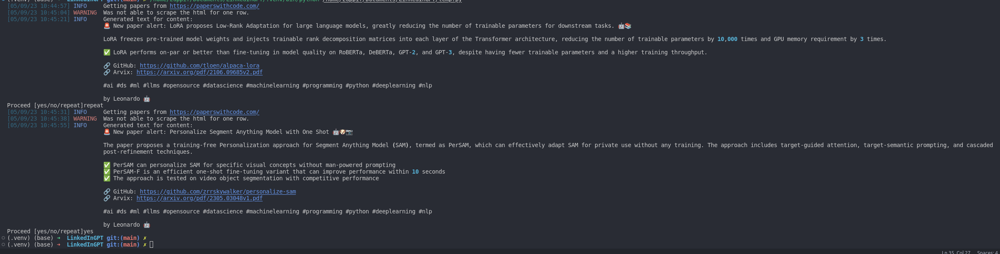
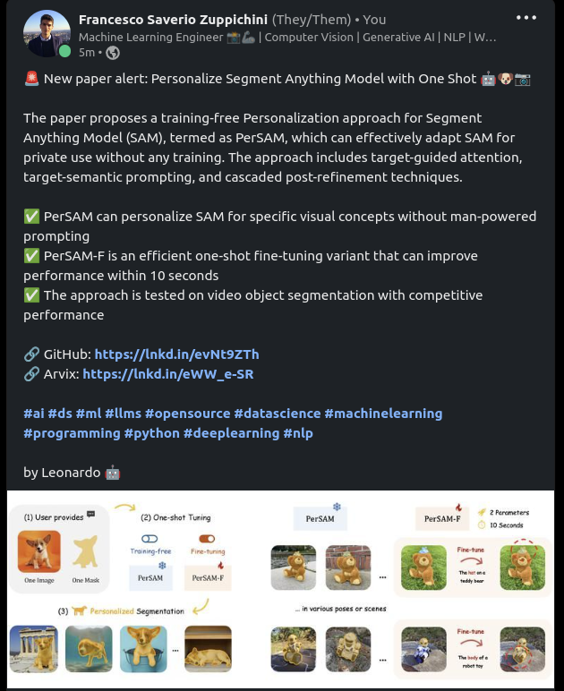

# LinkedIn GPT 💙🤖
> **Warning**
> I am using `python3.10`

Become the next guru on LinkedIn thanks to ChatGPT and Langchain. 

So far it works only on LinkedIn but I hope I made the APIs easy to extend. I recommend to check out the example code for the [linkedin ai guru](gurus/linkedin_ai.py)

> **Warning**
> 🚧 This is a work in progress project

## 💻 install

```bash
git clone git@github.com:FrancescoSaverioZuppichini/LinkedInGPT.git
cd LinkedInGPT
pip install -r requirements.txt
```

#### Env Variables

Be sure to export the following variables, you can place them in a `.env` file

```yaml
# .env file
LINKEDIN_TOKEN=<YOUR_LINKEDIN_TOKEN>
OPENAI_API_KEY=<YOUR_OPENAI_API_KEY>
```

**To obtain a `LINKEDIN_TOKEN` check out [`linkedin-python`](https://github.com/FrancescoSaverioZuppichini/linkedin_python#obtain-a-token)**

## Be a Guru 

So far, we have the following gurus

### LinkedIn AI giga chad 🗿

Run 

```bash
python gurus/linkedin_ai.py
```

This will create an automatic post with one of the trending papers from [papers with code](https://paperswithcode.com/). This is one example output



And this is the [generated post](https://www.linkedin.com/posts/francesco-saverio-zuppichini-94659a150_ai-ds-ml-activity-7061622366027558912-82VE?utm_source=share&utm_medium=member_desktop)



## How it works?
In a nutshell a Guru needs to be able to do 

- get the content
- store the content somewhere
- decide which content to post
- generate the post
- post it

The code for the LinkedIn guru loooks like 

```python
from langchain.chat_models import ChatOpenAI


from langchain.chains import LLMChain
from langchain.prompts import PromptTemplate

from src.guru import Guru
from src.actions.linkedIn import PostOnLinkedInAction
from src.storages import SQLiteStorage
from src.content_providers import TrendingAIPapersProvider
from src.confirmations.input_confirmation import input_confirmation

prompt = PromptTemplate(
    input_variables=["content", "bot_name"],
    template=Path("prompts/guru.prompt").read_text(),
)

llm = ChatOpenAI(temperature=0)

chain = LLMChain(llm=llm, prompt=prompt)

guru = Guru(
    name="Leonardo",
    content_provider=TrendingAIPapersProvider(),
    storage=SQLiteStorage(),
    action=PostOnLinkedInAction(),
    confirmation=input_confirmation,
    llm_chain=chain
)

guru.run()
```

- `content_provider` is in charge to get the content we will store and use in the prompt, in this case we get the trending ai papers from `paperswithcode`
- `storage` stores our contents and retrieves the ones we haven't created yet
- `action` is what we want to do with the content, in our case it will post on LinkedIn
- `confirmation` is a function that will ask for user confirmation, in this case we will just ask the user in the terminal
- `llm_chain` is our [`langchain` chain](https://python.langchain.com/en/latest/modules/chains.html)